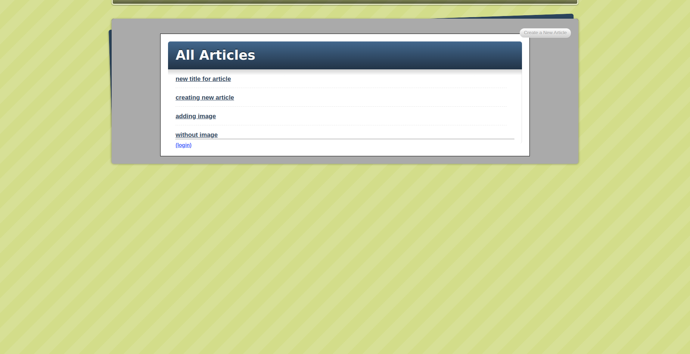

# Blog App

## Table of contents

- [About](#about)
- [Features](#features)
- [Live Demo](#live-demo)
- [Built with](#built-with)
- [Getting started](#getting-started)
  * [Prerequisites](#prerequisites)
  * [Installation instructions](#installation-instructions)
- [Authors](#authors)
- [Contributing](#-contributing)
- [Show your support](#show-your-support)
- [Acknowledgements](#acknowledgments)
- [License](#-license)

---

## About

This is a simple blog website where user can create, edit, delete an article and view blogs related to tags.

## Features

The features of this project are listed as below:

- User can register their account and perform login and logout operation.
- User can create an article with fields `title`, `body`, `image` and `tags`
- User can view all available articles.
- User can also view all available tags and a list of article related to specific tag.

## Live Demo

To quickly see our project in action, visit the [live demo]() on heroku.

## Built With

- Ruby
- Rails

## Getting Started

### Prerequisites

If you intend to download the project, you will need to have Ruby already installed on your machine. For more information on how to install Ruby, follow [this link.](https://www.ruby-lang.org/en/downloads/)

### Installation instructions

Follow along the steps below to get a copy at your local machine.

- Navigate to the directory where you want this project to live and then clone it `git clone https://github.com/sneeu-leeu/Blog-App.git`
- Navigate to the `Blog-App` directory
- install the gem package with `bundle install`
- Migrate the database on your local machine `rails db:migrate`
- Now run the rails server `rails server`
- Go to your browser and open [http://127.0.0.1:3000](http://127.0.0.1:3000)

## Authors

👤 **Dipesh Bajgain**

- GitHub: [@dipbazz](https://github.com/dipbazz)
- Twitter: [@dipbazz](https://twitter.com/dipbazz)
- LinkedIn: [Dipesh Bajgain](https://www.linkedin.com/in/dipbazz/)

👤 **Stephan Annandale**

- GitHub: [@sneeu-leeu](https://github.com/sneeu-leeu/)
- Twitter: [@Stephan07484055](https://twitter.com/Stephan07484055)
- LinkedIn: [Stephan Annandale](https://www.linkedin.com/in/stephan-annandale-a4b4931a9/)

## 🤝 Contributing

Contributions, issues, and feature requests are welcome!

## Show your support

Give a ⭐️ if you like this project!

## Acknowledgments

- This blog site is created by following [Jumpstart Lab’s Blogger Tutorial](http://tutorials.jumpstartlab.com/projects/blogger.html)

## 📝 License

This project is [MIT](./LICENSE) licensed.
